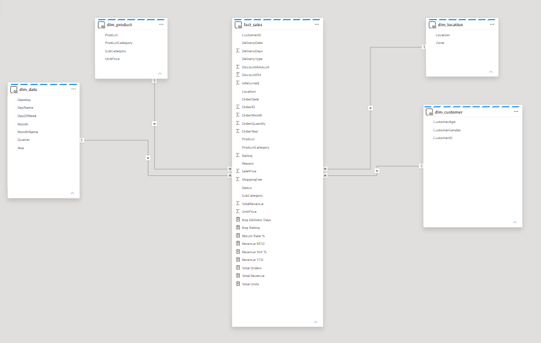
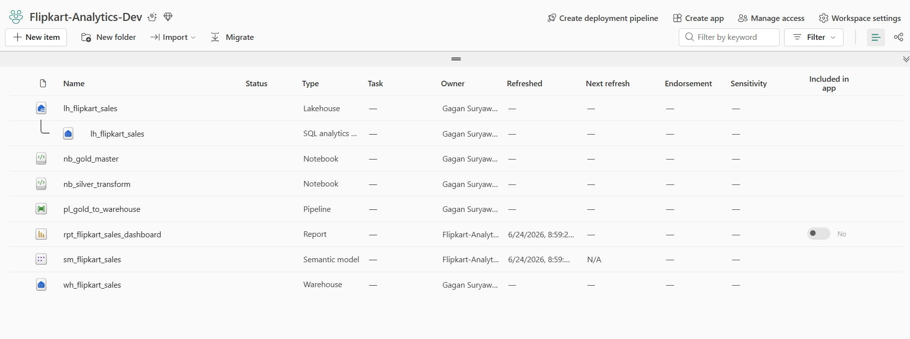
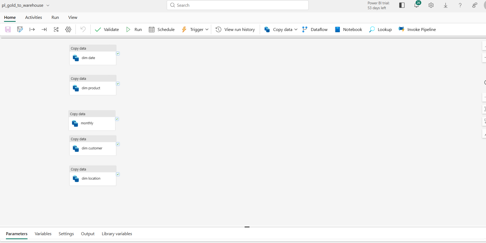
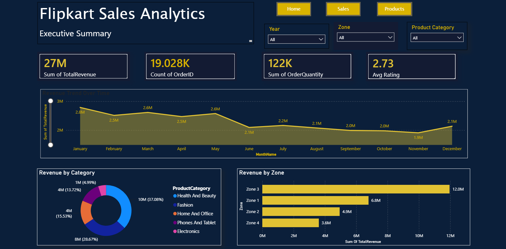
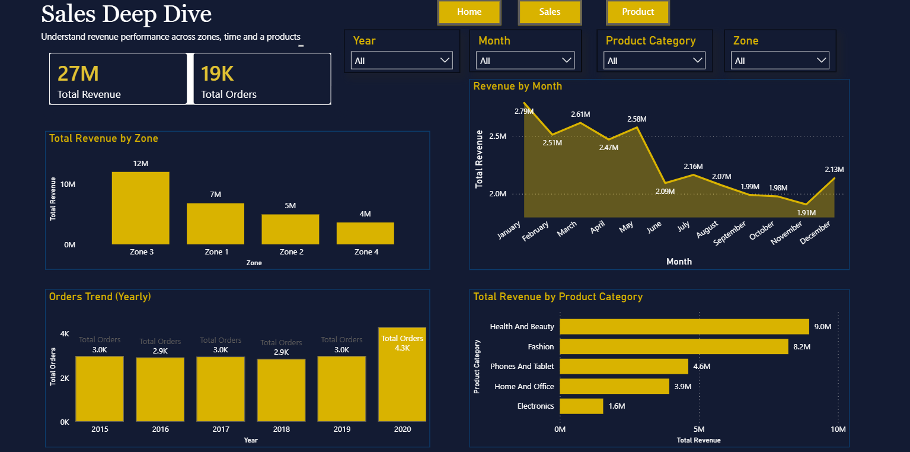
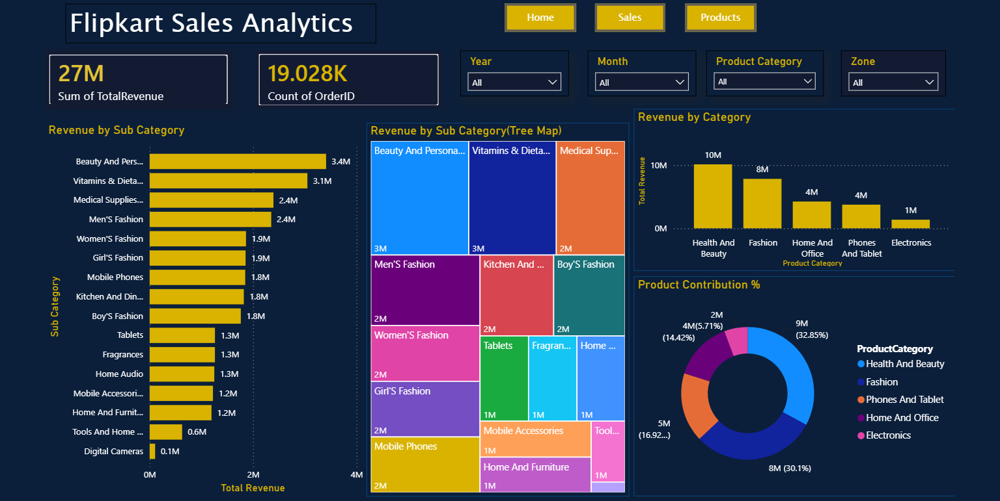

# 📊 Flipkart Sales Analytics using Microsoft Fabric

> **End-to-End Data Engineering & Business Intelligence Project using Microsoft Fabric, PySpark, SQL, and Power BI**

---

## 📌 Project Overview

This project demonstrates an end-to-end Retail Sales Analytics solution built using **Microsoft Fabric**. The solution follows the **Medallion Architecture (Bronze → Silver → Gold)** to ingest, clean, transform, and model Flipkart sales data before delivering business insights through interactive **Power BI dashboards**.

The project showcases the complete data engineering lifecycle—from raw data ingestion to data warehousing and visualization—using industry best practices.

---

## 🎯 Business Problem

Retail companies generate large volumes of sales data every day. Raw transactional datasets often contain:

- Missing values
- Duplicate records
- Inconsistent formats
- Invalid data
- Mixed data types

Without proper data engineering, business users cannot derive meaningful insights.

This project solves these problems by building a scalable analytics solution using Microsoft Fabric.

---

# 🏗 Project Architecture

```
Raw Excel Dataset
        │
        ▼
Bronze Layer (Raw Data)
        │
        ▼
Silver Layer (Data Cleaning & Standardization)
        │
        ▼
Gold Layer (Business Ready Data)
        │
        ▼
Fabric Warehouse
        │
        ▼
Semantic Model
        │
        ▼
Power BI Dashboard
```

---

# 🛠 Tech Stack

| Technology | Purpose |
|------------|---------|
| Microsoft Fabric | Data Engineering Platform |
| OneLake | Data Storage |
| Lakehouse | Data Storage & Processing |
| Fabric Notebook | Data Transformation |
| PySpark | Data Processing |
| Pandas | Data Cleaning |
| SQL | Data Modeling |
| Fabric Warehouse | Analytical Storage |
| Semantic Model | Reporting Model |
| Power BI | Dashboard & Visualization |
| Git & GitHub | Version Control |

---

# 🏛 Medallion Architecture

## 🥉 Bronze Layer

The Bronze layer stores the raw dataset without any modifications.

### Activities

- Imported raw Excel dataset
- Created Fabric Lakehouse
- Loaded source data
- Performed initial data profiling

Notebook:

```
Notebooks/Bronze/nb_bronze_ingestion.ipynb
```

---

## 🥈 Silver Layer

The Silver layer focuses on cleaning and standardizing the raw data.

### Data Cleaning Performed

- Removed null values
- Removed duplicate records
- Standardized delivery types
- Standardized customer gender values
- Standardized zone values
- Corrected inconsistent text values
- Converted data types
- Prepared clean business-ready dataset

Notebook:

```
Notebooks/Silver/nb_silver_transform.ipynb
```

---

## 🥇 Gold Layer

The Gold layer prepares business-ready analytical tables.

### Activities

- Created Fact Table
- Created Dimension Tables
- Built Star Schema
- Generated analytical metrics
- Prepared Warehouse-ready data

Notebook:

```
Notebooks/Gold/nb_gold_master.ipynb
```

---

# ⭐ Star Schema

The project follows a **Star Schema** dimensional model.

### Fact Table

- fact_sales

### Dimension Tables

- dim_customer
- dim_product
- dim_date
- dim_location

The Star Schema enables optimized analytical queries and faster Power BI reporting.

## Star Schema



---

# ☁ Microsoft Fabric Workspace

The solution was developed using Microsoft Fabric components including:

- Lakehouse
- Fabric Notebooks
- Pipeline
- Warehouse
- Semantic Model
- Power BI Report



---

# 🔄 Data Pipeline

A Fabric Pipeline was created to automate data movement from the Gold Layer into the Warehouse.

### Pipeline Activities

- Load Date Dimension
- Load Product Dimension
- Load Customer Dimension
- Load Location Dimension
- Load Sales Data



---

# 📈 Power BI Dashboard

## Executive Summary

Provides a high-level overview of:

- Total Revenue
- Total Orders
- Order Quantity
- Average Rating
- Revenue Trend
- Revenue by Category
- Revenue by Zone



---

## Sales Deep Dive

Provides detailed sales analysis including:

- Monthly Revenue Trend
- Zone-wise Revenue
- Product Category Revenue
- Yearly Order Trend



---

## Product Analytics

Provides detailed product performance including:

- Revenue by Category
- Revenue by Subcategory
- Product Contribution
- Treemap Visualization



---

# 📊 Key Business Insights

This dashboard helps answer important business questions such as:

- Which product category generates the highest revenue?
- Which zone contributes the most revenue?
- What are the monthly sales trends?
- Which products contribute the most revenue?
- How does customer purchasing behavior vary?
- Which regions perform better than others?

---

# 📁 Repository Structure

```
Flipkart-Sales-Analytics-Fabric
│
├── Dataset
│   ├── Selected_Extremely_Messy_Flipkart_Data.xlsx
│   └── Cleaned_Flipkart_Sales_Dataset.xlsx
│
├── Notebooks
│   ├── Bronze
│   ├── Silver
│   └── Gold
│
├── Images
│   ├── Fabric_Workspace.png
│   ├── Fabric_Pipeline.png
│   ├── Star_Schema.png
│   └── Dashboard
│
└── README.md
```

---

# 🚀 Future Enhancements

- Incremental Data Loading
- Real-Time Data Streaming
- Data Quality Monitoring
- CI/CD Deployment
- Machine Learning Sales Forecasting
- Row-Level Security (RLS)
- Automated Data Validation

---

# 🎓 Learning Outcomes

Through this project, I gained hands-on experience with:

- Microsoft Fabric
- Medallion Architecture
- Data Engineering
- PySpark
- Pandas
- SQL
- Lakehouse
- Fabric Warehouse
- Semantic Model
- Star Schema Design
- ETL Pipelines
- Power BI Dashboard Development

---

# 👨‍💻 Author

**Gagan Suryawanshi**

### Skills

- Microsoft Fabric
- PySpark
- SQL
- Python
- Power BI
- Data Engineering
- ETL
- Data Modeling
- Business Intelligence

---

⭐ If you found this project useful, feel free to star the repository.
